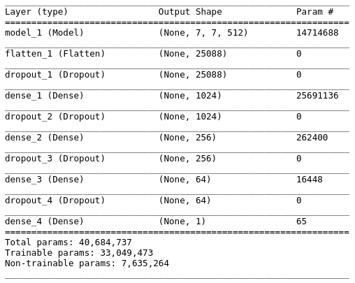
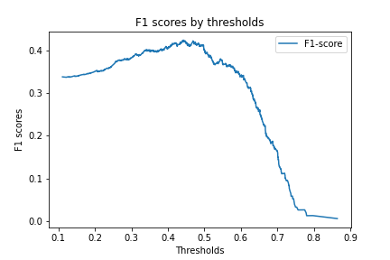
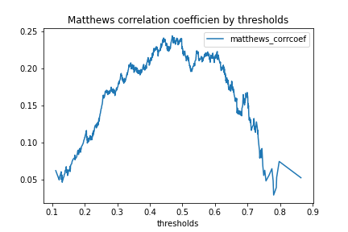

# FDA  Submission

**Your Name: Alexandru Korotcov**

**Name of your Device: 2D Chest X-ray Pneumonia Detection Assistant (X-PDA)**

## Algorithm Description 

### 1. General Information

**Intended Use Statement:** 

Assisting Radiologist in Pneumonia detection on 2D Chest X-ray images 

**Indications for Use:**

X-PDA is a computer based assistant intended to use for assisting radiologists in the detection of Pneumonia in 2D Chest X-ray images (both posterior-anterior and anterior-posterior views) acquired in general population (males and females) of 13 to 81 years old (95% confidence interval, although the X-PDA was trained on the images acquired on a population 1 to 95 years old). The assistant can be used in the presence of other diseases and typically comorbid with Infiltration, Edema, Effusion, Atelectasis, and Consolidation.  The Pneumonia X-ray images average pixel intensity distribution looks similar to that of Fibrosis, Mass and Pleural Thickening, therefore the Pneumonia images have their own patterns and can be used in cases with other diseases because the X-PDA is using image patterns for Pheumonia detection assistance.  

**Device Limitations:**

The system would require a high performance computing power in cloud or a local workstation. It requires 2D X-Ray images properly logged in by a technician. The assistant won’t process any images if  the DICOM header doesn’t have properly filled out fields such as: Modality, PatientPosition, BodyPartExamined, and PatientAge less than 13 or above 81 years old. 

**Clinical Impact of Performance:**

Precision (positive predictive rate, positive cases accurately identified by the algorithm) is 0.338. This low precision means that the assistant would have a high false positive rate. Because of this, positively predicted tests (could be wrong) are not good for diagnostics, especially to confirm a suspected diagnosis. 

Recall (specificity – proportion of accurately identified negative cases) is 0.615. This is a good recall, thus if the assistant returns a negative result, we can be confident that the result is truly negative since a high recall test has low false negatives. High recall tests are good for things like screening studies, where you want to make sure someone doesn’t have a disease or worklist prioritization where you want to make sure that people without the disease are being de-prioritized. 

Our X-PDA could be used to assist radiologist, specifically assisting in identification of non-Pneumonia cases with a good specificity.

### 2. Algorithm Design and Function

**DICOM Checking Steps:**

[pydicom](https://pydicom.github.io/) library is used to load DICOM image.

The following checks are performed:

1. Check for Modality to be ‘DX’ - Digital Radiography
2. Check for Patient Age in range of 13 to 81 years old
3. Check for PatientPosition is ‘AP’ or ‘PA’ (posterior-anterior and posterior-anterior views)
4. Check for BodyPartExamined is 'CHEST'

The X-PDA won’t perform any predictions without all 4 criteria are met.

**Preprocessing Steps:**

The loaded DICOM image converted into array, intensities normalized to be in range of 0 to 1 by dividing all values by 255, and the image is resized to 224x224 using [scikit-image](https://scikit-image.org/docs/dev/api/skimage.html) library, which is a requirement for the input shape of the model.

**CNN Architecture:**

The algorithm used a pre-trained [VGG16](https://arxiv.org/abs/1409.1556) CNN on [ImageNet](http://www.image-net.org/) dataset without the last flatten layer. 

All of those layers were frozen but the last convolution and pooling layers. The last pooling layer was used as an input to the following network:

 
### 3. Algorithm Training

**Parameters:**
* Types of augmentation used during training
    * rescale 1/255.
    * horizontal_flip
    * height shift range 0.1
    * width shift range 0.1
    * rotation range 10 degree 
    * shear range 0.1
    * zoom range 0.1
* Batch size: 64
* Optimizer learning rate: starting rate 1e-4 and was reduce by a factor of 0.5 in case of validation loss didn’t change for 3 epochs. The minimum learning rate was set to 1e-7.
* Layers of pre-existing architecture that were frozen: all but the last convolution and pooling layers
* Layers of pre-existing architecture that were fine-tuned: the last convolution and pooling layers (block5_conv3 and block5_pool)
* Layers added to pre-existing architecture
    1. Flatten
    2. Dense, 1024
    3. Dropout, 0.2
    4. Dense, 0.2
    5. Dense, 64  
    6. Dropout, 0.2
    7. Dense, 1   
* Earlier algorithm training stopping with patience of 10 epochs

### Algorithm training performance visualization 

**Model training history:**

 

The training loss was going down and the validation loss was staying about the same after 15th epoch. The best model was automatically saved after 15th epochs and was used for Assistant.

**Receiver Operating Characteristics curve (ROC)**

 

The ROC curve indicate that the model can perform better than a simple guess (dotted line) with Area Under The Curve (AUC) of 0.69.

**Precision-Recall (PR) curve**

The PR curve indicates that we have a somewhat low precision, especially looking into the Average Precision (AP) score, which is a weighted mean of precision's achieved at each threshold. On the other hand, we can see, that the precision can be traded for the higher Recall, which will be used by our Assistant.

**Final Threshold and Explanation:**

 

To decide which threshold is the best for our X-PDA model we have evaluated F1 scores and Mathews correlation coefficients. We can use two approaches:
1. to maximize balance between Precison and Recall, which is equivalent of maximizing F1 score
2. to maximize balance between true and false positives and negatives, which is is equivalent of maximizing the [Matthew’s correlation coefficient (MCC)](https://en.wikipedia.org/wiki/Matthews_correlation_coefficient)  

We have decided to use MCC to define the best threshold due to F1 score that doesn’t take into account true negative values, which is important for our X-PDA.

Maximum MCC was at a threshold of 0.217, and is 0.262. The F1-score is 0.437, Precision is 0.338, and Recall is 0.615, at best MCC threshold is at 0.217.

### 4. Databases
 
The dataset provided by the NIH specifically to address the problem of a lack of large x-ray datasets with ground truth labels to be used in the creation of disease detection algorithms. 

The data can be downloaded from the [kaggle website](https://www.kaggle.com/nih-chest-xrays/data)

Representative Chest X-Ray images are shown below:

**Description of Training Dataset:** 

The Dataset used in building this Assistant was extracted from the original NIH dataset. The are only 1.28% of Pneumonia cases in the original NIH dataset. The dataset was downsampled randomly for the majority class (non-Pneumonia) in such a way that the Pneumonia fraction became 20%, which is about the proper ratio of the Pneumonia cases in a clinic. Then, the downsampled dataset was split into Training and Validaton datasets.

The Training dataset consisted from 5725 validated images with 20% of positive Pneumonia cases.

**Description of Validation Dataset:** 

The Validation dataset consisted from 1430 validated images with 20% of positive Pneumonia cases.

### 5. Ground Truth

There are 112,120 X-ray images with disease labels from 30,805 unique patients in this dataset. The disease labels were created using Natural Language Processing (NLP) to mine the associated radiological reports. The labels include 14 common thoracic pathologies: 

- Atelectasis 
- Consolidation 
- Infiltration 
- Pneumothorax 
- Edema 
- Emphysema 
- Fibrosis 
- Effusion 
- Pneumonia 
- Pleural thickening 
- Cardiomegaly 
- Nodule 
- Mass 
- Hernia 

The biggest limitation of this dataset is that image labels were NLP-extracted so there could be some erroneous labels but the **NLP labeling accuracy is estimated to be >90%.** 

The original radiology reports are not publicly available but you can find more details on the labeling process [here](https://arxiv.org/abs/1705.02315). 

### 6. FDA Validation Plan

**Patient Population Description for FDA Validation Dataset:**

* General population both genders, males and females
* Age is restricted to population of 13 to 81 years old
* Patients can have any other common thoracic pathologies (listed in Ground Truth section)

**Ground Truth Acquisition Methodology:**

The silver standard approach of using several radiologists would be the most optimal for our X-PDA validation.

**Algorithm Performance Standard:**

[CheXNet](https://arxiv.org/pdf/1711.05225.pdf): Radiologist-Level Pneumonia Detection on Chest X-Rays with Deep Learning currently is a state of the art algorithm with a level of Pneumonia detection exceeding average practicing radiologist performance on the F1 metric. 

<table>
<thead>
<tr>
<th></th>
<th>F1 Score</th>
</tr>
</thead>
<tbody>
<tr>
<td>Radiologist Average</td>
<td>0.387</td>
</tr>
<tr>
<td>ChestXNet</td>
<td>0.435</td>
</tr>
<tr>
<td>X-PDA</td>
<td>0.437</td>
</tr>
</tbody>
</table>

We compared the radiologists average, ChestXNet model and our X-PDA on the F1 metric, which is the harmonic average of the precision and recall of the models. X-PDA achieves F1 score of 0.437, which is within 95% confidence interval of the state of the art ChestXNet model and higher than the radiologist average.